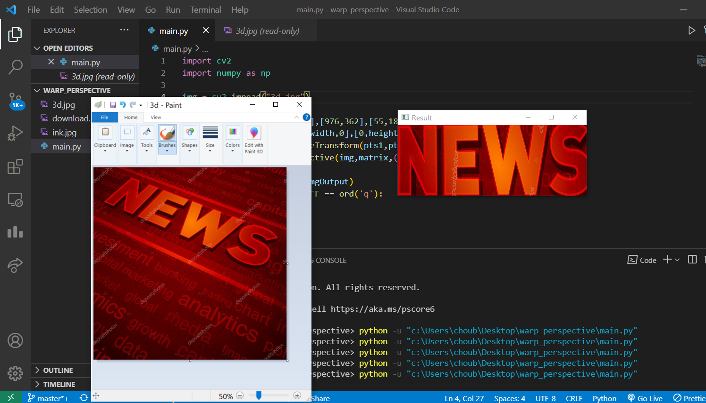

# Warp-Perspective
This is a helper file which changes the perspective and flattens any given part of a 3d image. 
It requires the corner points of the part which we want to be flattened.

On the left we have the original image and on the right we have the result.
